# 🎨 Görsel Proje Haritası

> Mermaid diyagramları ile interaktif proje görselleştirmesi

---

## 🏗️ Genel Mimari

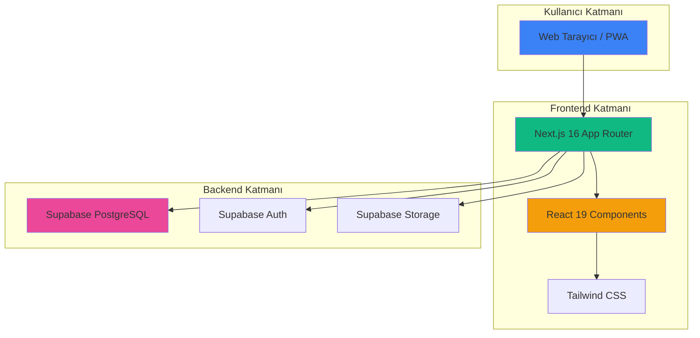

---

## 📊 Veritabanı İlişki Diyagramı

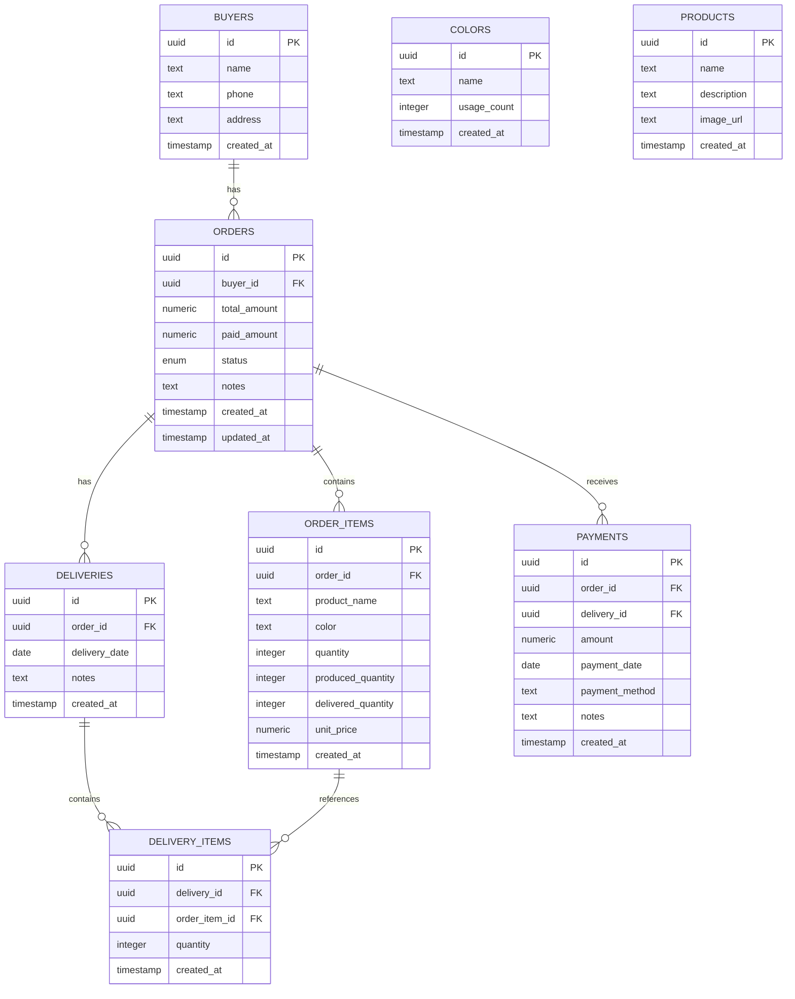

---

## 🔄 Sipariş Yaşam Döngüsü

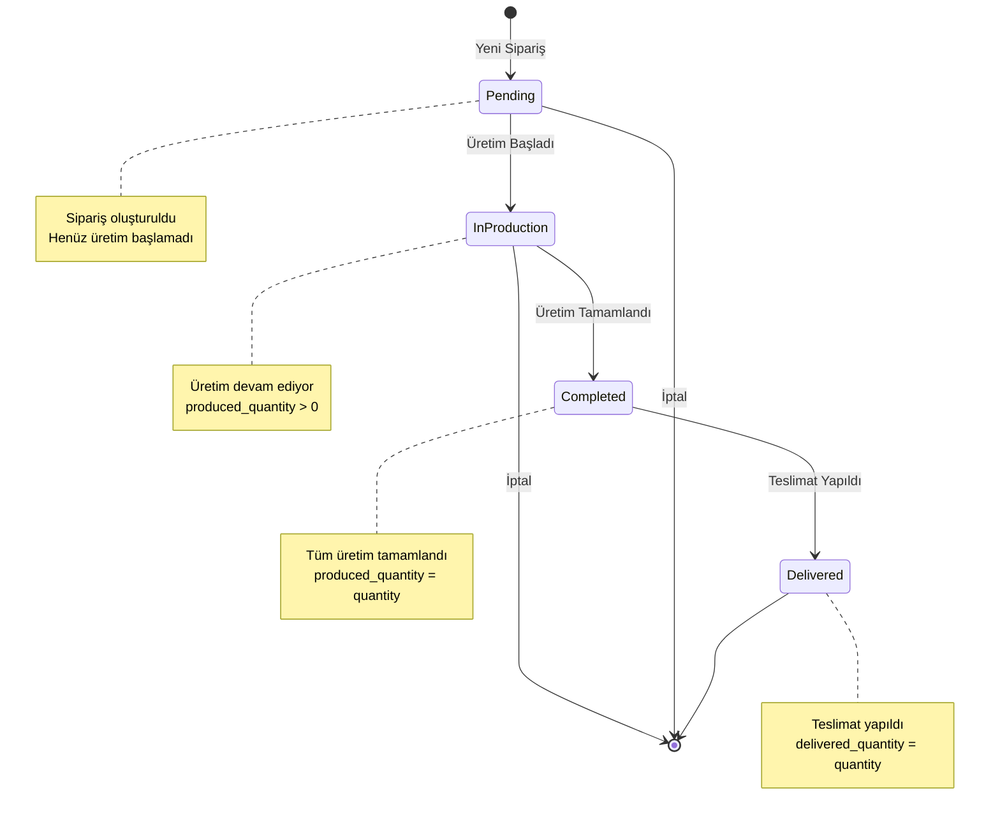

---

## 📁 Klasör Yapısı Ağacı

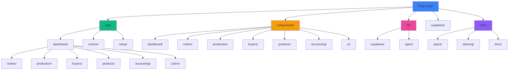

---

## 🔄 Sipariş Oluşturma Akışı

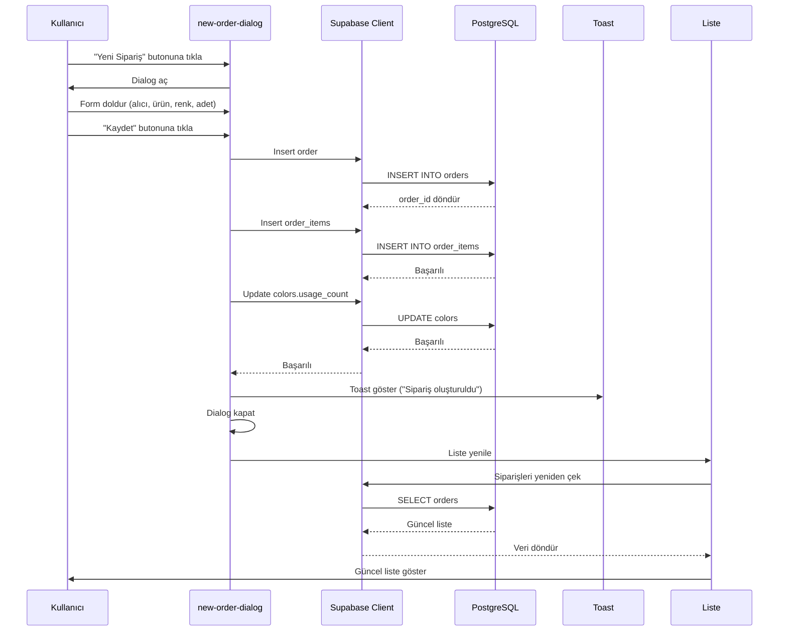

---

## 🏭 Üretim Güncelleme Akışı

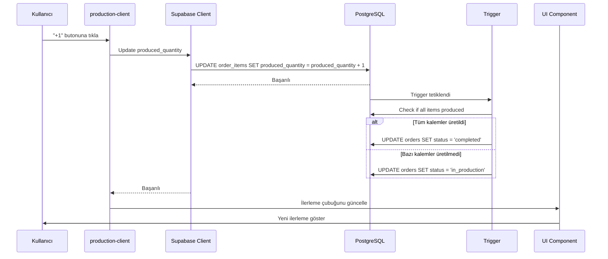

---

## 📦 Teslimat Akışı

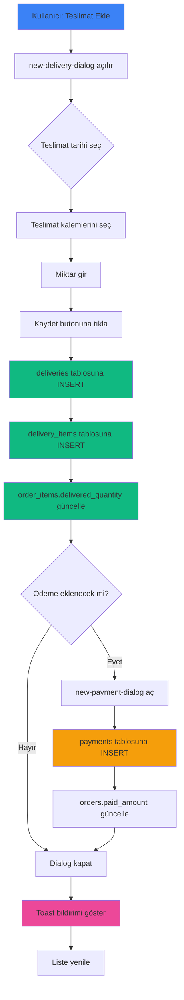

---

## 🎯 Component İlişki Haritası

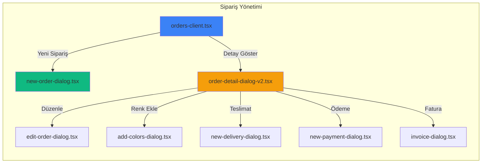

---

## 📊 Dashboard Bileşenleri

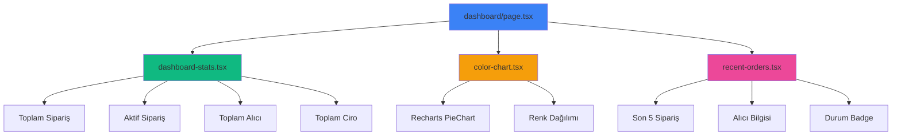

---

## 🔐 Supabase Client Kullanımı

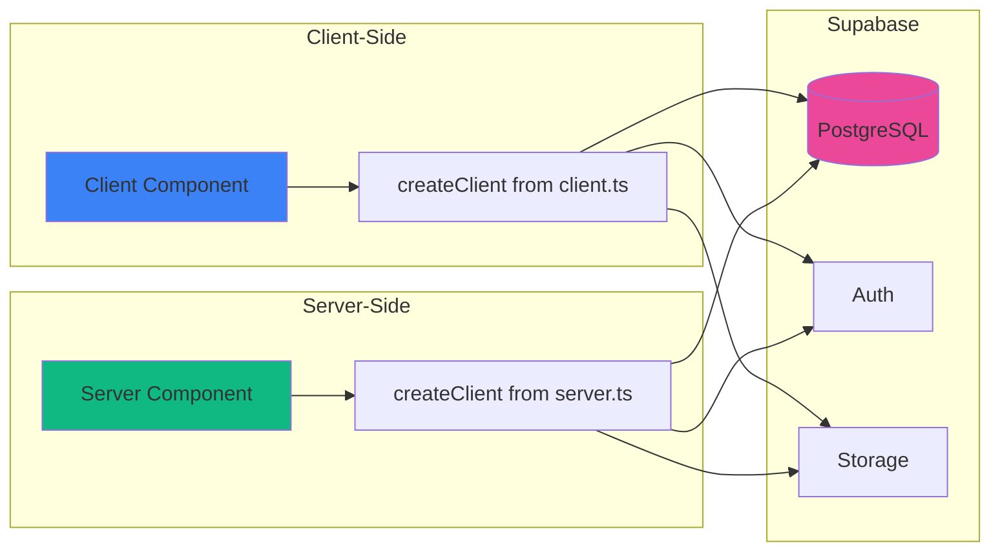

---

## 🎨 UI Component Hiyerarşisi

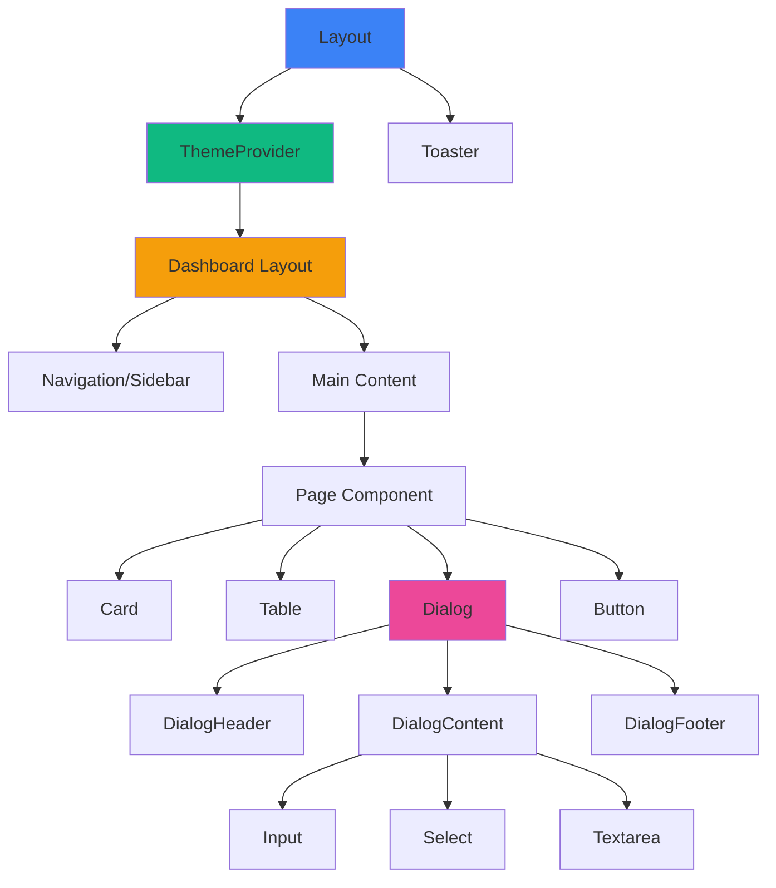

---

## 🔄 State Yönetimi Akışı

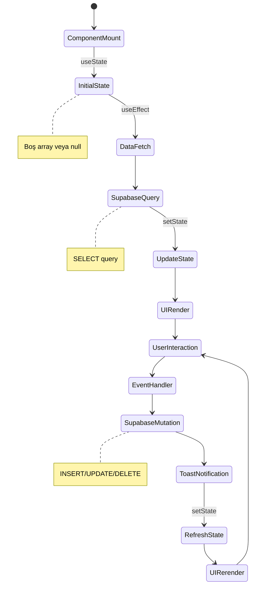

---

## 📈 Token Optimizasyonu Akışı

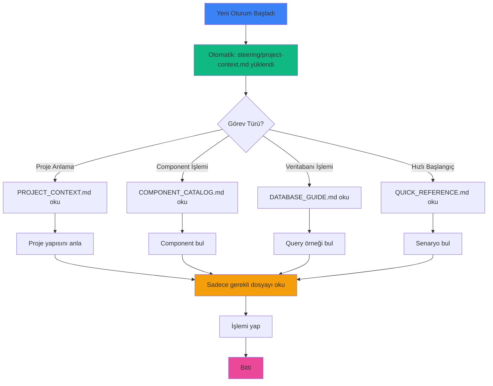

---

## 🚀 Geliştirme Workflow

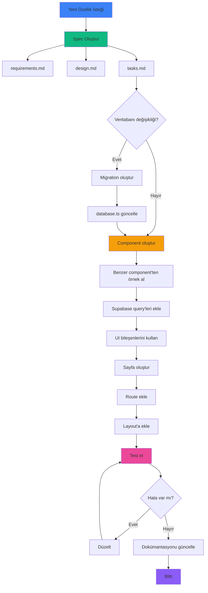

---

## 🎯 Özellik Modülleri

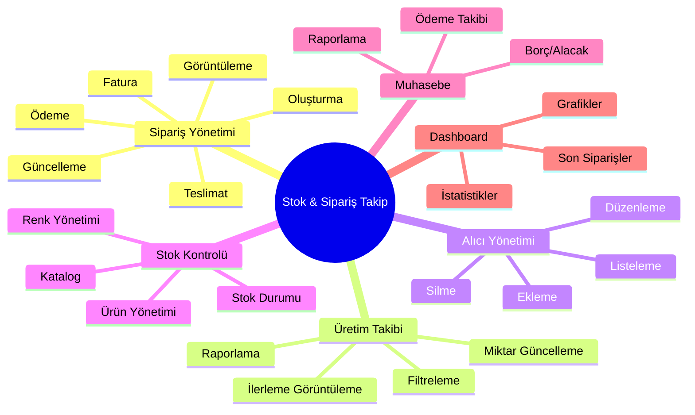

---

## 🔗 Veri İlişkileri (Detaylı)

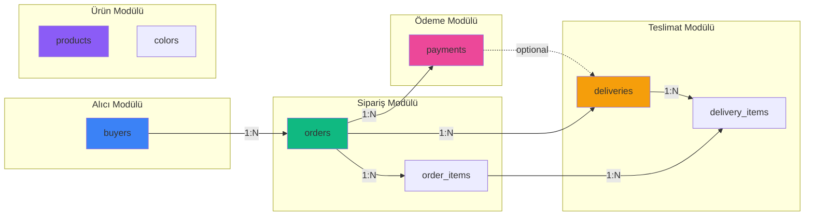

---

## 📱 PWA Yapısı

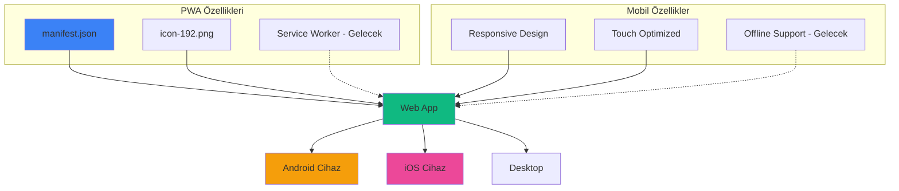

---

**Not:** Bu diyagramlar Mermaid formatında hazırlanmıştır. GitHub, GitLab, Obsidian ve birçok Markdown görüntüleyici bu diyagramları otomatik olarak render eder.

**Son Güncelleme:** 5 Mayıs 2026  
**Versiyon:** 1.0.0
