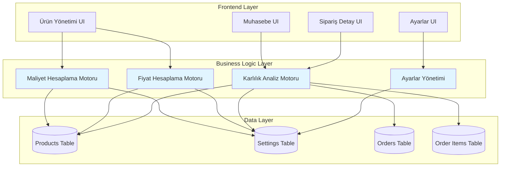
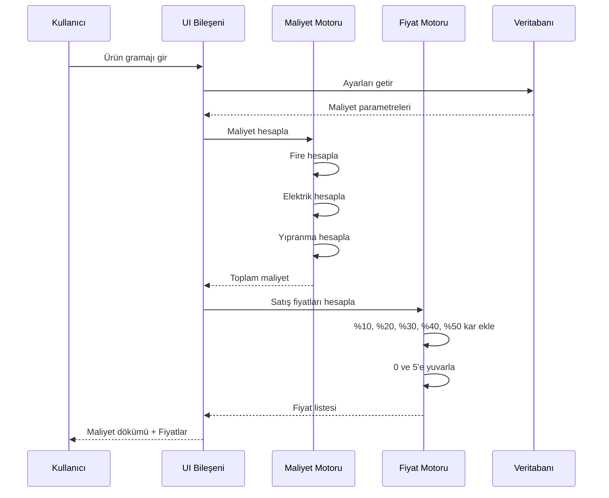

# Tasarım Dokümanı: Gelişmiş Ürün Maliyet Hesaplama ve Muhasebe Sistemi

## Genel Bakış

Bu özellik, mevcut stok ve sipariş takip sistemine kapsamlı bir maliyet hesaplama ve muhasebe modülü ekler. Sistem, ürün bazlı maliyet analizi, dinamik fiyatlandırma, sipariş bazlı karlılık analizi ve yapılandırılabilir maliyet parametreleri sağlar.

**Temel Hedefler:**
- Ürün bazında detaylı maliyet dökümü (filament, elektrik, fire, yıpranma)
- Farklı kar marjlarıyla otomatik satış fiyatı hesaplama
- Sipariş bazlı gerçek maliyet ve karlılık analizi
- Dinamik ve yapılandırılabilir maliyet parametreleri
- Muhasebe ekranında gelişmiş finansal raporlama

**Kapsam:**
- Ürün tablosuna yeni alanlar ekleme (gramaj, maliyet bilgileri)
- Yeni ayarlar (settings) tablosu ve yönetim arayüzü
- Gelişmiş muhasebe ekranı ve raporlama
- Sipariş bazlı maliyet analizi
- Otomatik fiyat hesaplama ve öneri sistemi

---

## Mimari

### Sistem Bileşenleri



### Veri Akışı Diyagramı



---

## Bileşenler ve Arayüzler

### Bileşen 1: Maliyet Hesaplama Motoru (CostCalculationEngine)

**Amaç**: Ürün bazında detaylı maliyet hesaplamaları yapmak

**Arayüz**:
```typescript
interface CostCalculationEngine {
  calculateProductCost(params: CostCalculationParams): ProductCostBreakdown
  calculateOrderCost(orderId: string): OrderCostAnalysis
  calculateBatchCost(items: OrderItem[]): BatchCostAnalysis
}

interface CostCalculationParams {
  gramWeight: number
  filamentPricePerKg: number
  settings: CostSettings
}

interface ProductCostBreakdown {
  rawFilamentCost: number      // Saf filament maliyeti
  electricityCost: number       // Elektrik maliyeti
  wasteCost: number             // Fire maliyeti
  wearCost: number              // Yıpranma maliyeti
  totalCost: number             // Toplam maliyet
  costPerGram: number           // Gram başına maliyet
}

interface CostSettings {
  filamentPricePerKg: number
  electricityCostPerGram: number
  wastePercentage: number
  wearCostPerGram: number
  isElectricityEnabled: boolean
  isWasteEnabled: boolean
  isWearEnabled: boolean
}
```

**Sorumluluklar**:
- Gramaj bazlı filament maliyeti hesaplama
- Fire oranı uygulama (%10 varsayılan)
- Elektrik maliyeti hesaplama (gram başına 0.1 TL)
- Yıpranma maliyeti hesaplama (gram başına 0.05 TL)
- Aktif/pasif parametreleri kontrol etme
- Toplam maliyeti hesaplama

---

### Bileşen 2: Fiyat Hesaplama Motoru (PriceCalculationEngine)

**Amaç**: Maliyet üzerine kar marjı ekleyerek satış fiyatları hesaplamak

**Arayüz**:
```typescript
interface PriceCalculationEngine {
  calculatePriceWithMargin(cost: number, marginPercent: number): number
  calculatePriceTiers(cost: number): PriceTier[]
  roundToNearestFive(price: number): number
}

interface PriceTier {
  marginPercent: number
  rawPrice: number
  roundedPrice: number
  profit: number
}
```

**Sorumluluklar**:
- Maliyet üzerine kar marjı ekleme (%10, %20, %30, %40, %50)
- Fiyatları 0 ve 5'e yuvarlama (örn: 127.3 → 130, 132.8 → 135)
- Kar tutarını hesaplama
- Fiyat kademelerini oluşturma

---

### Bileşen 3: Karlılık Analiz Motoru (ProfitabilityAnalysisEngine)

**Amaç**: Sipariş bazında gerçek maliyet ve karlılık analizi yapmak

**Arayüz**:
```typescript
interface ProfitabilityAnalysisEngine {
  analyzeOrder(orderId: string): OrderProfitabilityReport
  analyzeBuyer(buyerId: string): BuyerProfitabilityReport
  analyzeProduct(productName: string): ProductProfitabilityReport
}

interface OrderProfitabilityReport {
  orderId: string
  buyerName: string
  items: OrderItemCostAnalysis[]
  totalRevenue: number
  totalCost: number
  totalProfit: number
  profitMargin: number
  totalFilamentKg: number
  totalFilamentCost: number
}

interface OrderItemCostAnalysis {
  productName: string
  color: string
  quantity: number
  producedQuantity: number
  gramPerUnit: number
  totalGrams: number
  totalGramsWithWaste: number
  unitCost: number
  totalCost: number
  unitPrice: number
  totalRevenue: number
  profit: number
  profitMargin: number
}
```

**Sorumluluklar**:
- Sipariş bazında toplam maliyet hesaplama
- Ürün bazında maliyet analizi
- Gerçek üretim miktarını dikkate alma (produced_quantity)
- Fire dahil toplam filament kullanımı hesaplama
- Kar marjı hesaplama
- Alıcı bazında toplam karlılık analizi

---

### Bileşen 4: Ayarlar Yönetimi (SettingsManager)

**Amaç**: Maliyet parametrelerini dinamik olarak yönetmek

**Arayüz**:
```typescript
interface SettingsManager {
  getSettings(): Promise<CostSettings>
  updateSetting(key: string, value: number | boolean): Promise<void>
  resetToDefaults(): Promise<void>
  validateSettings(settings: Partial<CostSettings>): ValidationResult
}

interface ValidationResult {
  isValid: boolean
  errors: string[]
}
```

**Sorumluluklar**:
- Ayarları veritabanından okuma
- Ayarları güncelleme
- Varsayılan değerlere sıfırlama
- Ayar validasyonu (negatif değer kontrolü, mantıksal sınırlar)
- Cache yönetimi

---

## Veri Modelleri

### Model 1: Products Tablosu (Genişletilmiş)

```typescript
interface Product {
  id: string
  name: string
  description: string | null
  image_url: string | null
  gram_weight: number                    // YENİ: Ürün gramajı
  created_at: string
}
```

**Validasyon Kuralları**:
- `gram_weight` pozitif sayı olmalı (> 0)
- `gram_weight` maksimum 10000 gram (10 kg) olabilir
- `gram_weight` ondalık değer alabilir (örn: 42.5)

---

### Model 2: Settings Tablosu (YENİ)

```typescript
interface Setting {
  id: string
  key: string                            // Ayar anahtarı (unique)
  value: string                          // JSON string olarak değer
  value_type: 'number' | 'boolean'       // Değer tipi
  category: 'cost' | 'general'           // Kategori
  label: string                          // Kullanıcı dostu etiket
  description: string                    // Açıklama
  is_enabled: boolean                    // Aktif/pasif
  default_value: string                  // Varsayılan değer
  min_value: number | null               // Minimum değer (number için)
  max_value: number | null               // Maksimum değer (number için)
  unit: string | null                    // Birim (TL, %, kg, vb.)
  display_order: number                  // Görüntüleme sırası
  created_at: string
  updated_at: string
}
```

**Varsayılan Ayarlar**:
```typescript
const DEFAULT_SETTINGS: Setting[] = [
  {
    key: 'filament_price_per_kg',
    value: '650',
    value_type: 'number',
    category: 'cost',
    label: 'Filament Fiyatı (kg)',
    description: 'Kilogram başına filament maliyeti',
    is_enabled: true,
    default_value: '650',
    min_value: 0,
    max_value: 10000,
    unit: 'TL/kg',
    display_order: 1
  },
  {
    key: 'electricity_cost_per_gram',
    value: '0.1',
    value_type: 'number',
    category: 'cost',
    label: 'Elektrik Maliyeti',
    description: 'Gram başına elektrik maliyeti',
    is_enabled: true,
    default_value: '0.1',
    min_value: 0,
    max_value: 10,
    unit: 'TL/gram',
    display_order: 2
  },
  {
    key: 'waste_percentage',
    value: '10',
    value_type: 'number',
    category: 'cost',
    label: 'Fire Oranı',
    description: 'Üretim sırasında fire oranı',
    is_enabled: true,
    default_value: '10',
    min_value: 0,
    max_value: 100,
    unit: '%',
    display_order: 3
  },
  {
    key: 'wear_cost_per_gram',
    value: '0.05',
    value_type: 'number',
    category: 'cost',
    label: 'Yıpranma Maliyeti',
    description: 'Gram başına ekipman yıpranma maliyeti',
    is_enabled: true,
    default_value: '0.05',
    min_value: 0,
    max_value: 10,
    unit: 'TL/gram',
    display_order: 4
  }
]
```

**Validasyon Kuralları**:
- `key` unique olmalı
- `value` JSON parse edilebilir olmalı
- `value_type` 'number' ise, value sayısal olmalı
- `value_type` 'boolean' ise, value 'true' veya 'false' olmalı
- `min_value` ve `max_value` varsa, value bu aralıkta olmalı
- `is_enabled` false ise, hesaplamalarda kullanılmamalı

---

### Model 3: Order Items (Genişletilmiş Analiz)

```typescript
interface OrderItemWithCost extends OrderItem {
  // Mevcut alanlar
  id: string
  order_id: string
  product_name: string
  color: string
  quantity: number
  produced_quantity: number
  delivered_quantity: number
  unit_price: number
  created_at: string
  
  // Hesaplanan maliyet alanları (runtime)
  gram_weight: number
  total_grams: number
  total_grams_with_waste: number
  unit_cost: number
  total_cost: number
  profit_per_unit: number
  total_profit: number
  profit_margin: number
}
```

---

## Ana Algoritma/İş Akışı

### İş Akışı 1: Ürün Maliyet Hesaplama

```mermaid
sequenceDiagram
    participant U as Kullanıcı
    participant UI as Ürün Formu
    participant CE as Maliyet Motoru
    participant PE as Fiyat Motoru
    participant DB as Veritabanı
    
    U->>UI: Gramaj gir (örn: 40gr)
    UI->>DB: Ayarları getir
    DB-->>UI: CostSettings
    
    UI->>CE: calculateProductCost(40, settings)
    
    CE->>CE: rawFilament = 40 * (650/1000) = 26 TL
    CE->>CE: waste = 40 * 0.10 = 4gr
    CE->>CE: totalGrams = 40 + 4 = 44gr
    CE->>CE: electricity = 44 * 0.1 = 4.4 TL
    CE->>CE: wear = 44 * 0.05 = 2.2 TL
    CE->>CE: totalCost = 26 + 4.4 + 2.2 = 32.6 TL
    
    CE-->>UI: ProductCostBreakdown
    
    UI->>PE: calculatePriceTiers(32.6)
    
    PE->>PE: %10 kar: 32.6 * 1.10 = 35.86 → 35 TL
    PE->>PE: %20 kar: 32.6 * 1.20 = 39.12 → 40 TL
    PE->>PE: %30 kar: 32.6 * 1.30 = 42.38 → 40 TL
    PE->>PE: %40 kar: 32.6 * 1.40 = 45.64 → 45 TL
    PE->>PE: %50 kar: 32.6 * 1.50 = 48.90 → 50 TL
    
    PE-->>UI: PriceTier[]
    
    UI-->>U: Maliyet dökümü + Fiyat tablosu göster
