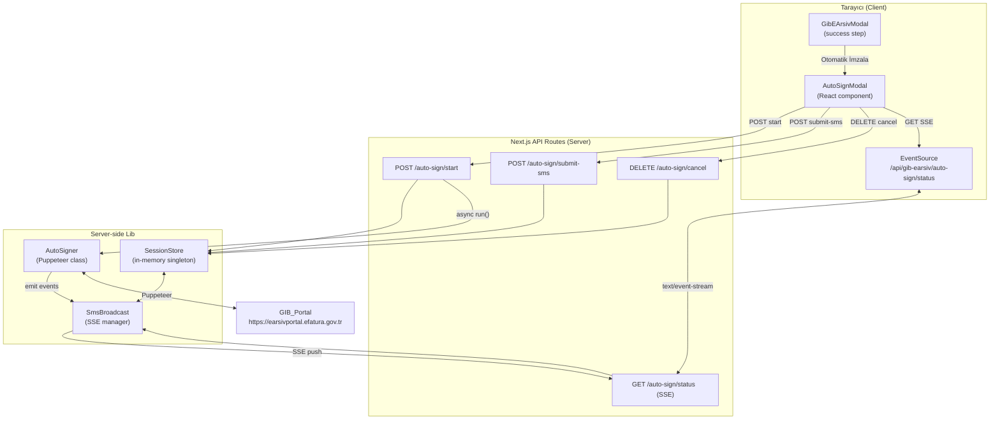
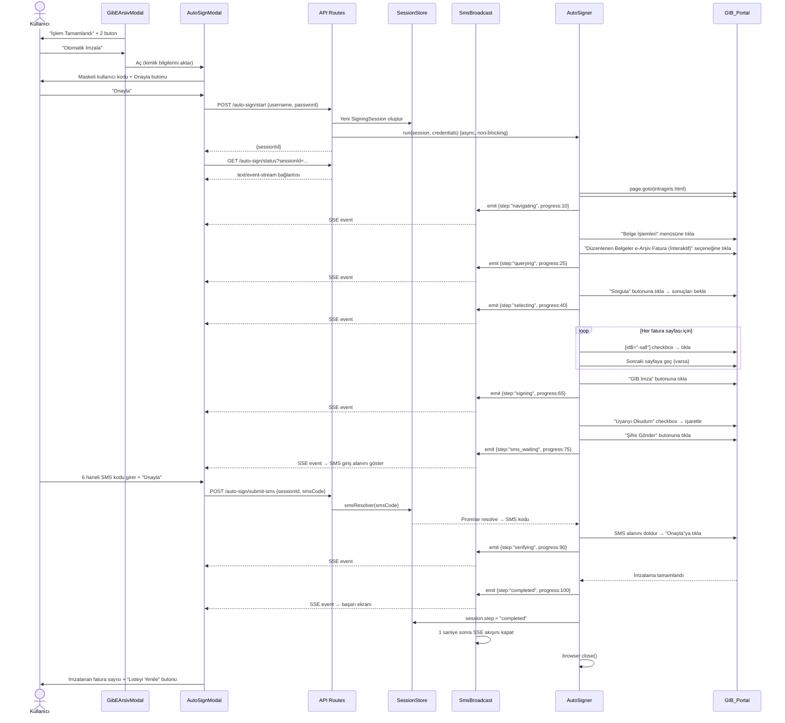
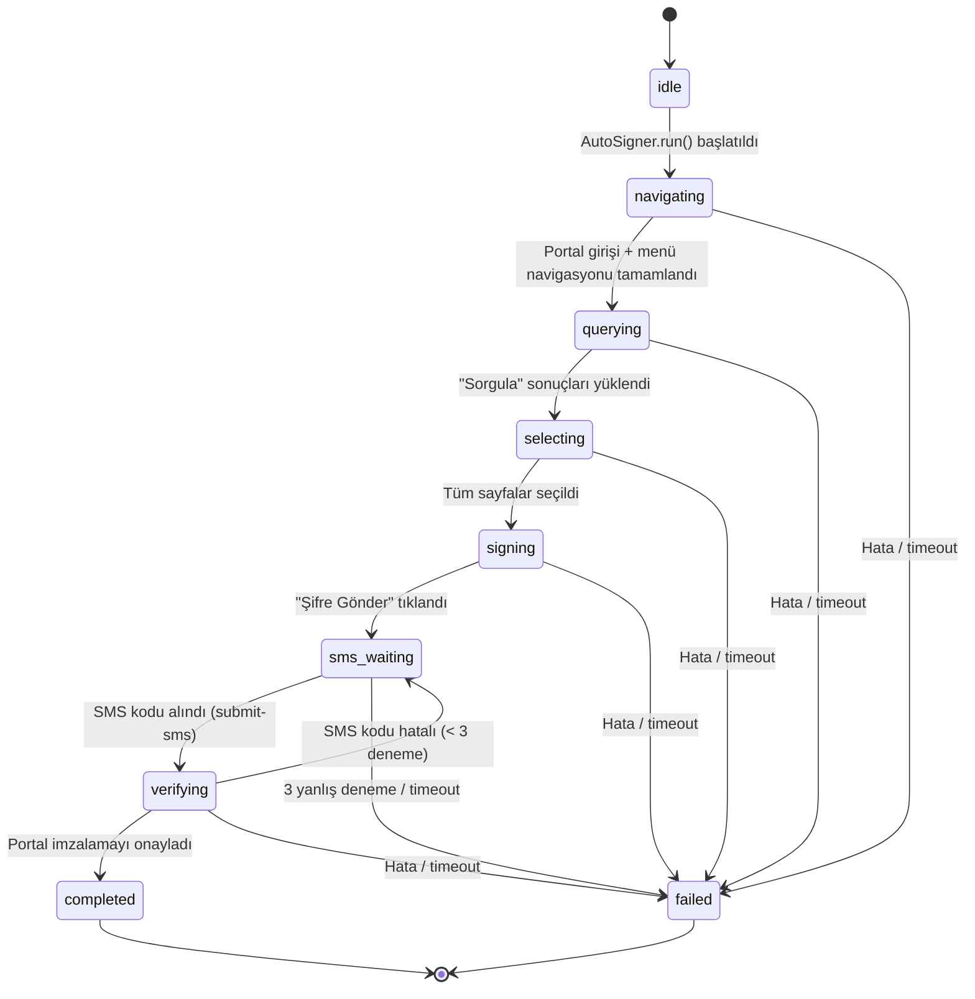

# Design Document — GİB e-Arşiv Otomatik İmzalama

## Overview

Bu özellik, mevcut **GibEArsivModal** fatura kesme akışının başarı adımına iki seçenek ekler:
"Otomatik İmzala" ve "Sadece Tamamla". Kullanıcı "Otomatik İmzala"yı seçtiğinde yeni bir
**AutoSignModal** açılır ve portal kimlik bilgilerini onayladıktan sonra sunucu tarafında bir
**AutoSigner** (Puppeteer otomasyonu) başlatılır. AutoSigner portal üzerinde oturum açar,
"Belge İşlemleri → Düzenlenen Belgeler e-Arşiv Fatura (İnteraktif)" menüsünü izler, günlük
faturaları sorgular, tüm sayfaları seçer, GİB İmza popup'ını tetikler ve SMS kodu için
kullanıcıya geri döner. Tüm süreç boyunca durum olayları **SSE (Server-Sent Events)** ile
tarayıcıya iletilir.

Mevcut altyapıyla entegrasyon şöyle kurulur:
- Tarayıcı yönetimi için mevcut `gib-browser-automation.ts` dosyasındaki Puppeteer yapılandırması
  (headless: false, args, dialog handler) **doğrudan** `AutoSigner` sınıfına taşınır; `launch-browser`
  route'u bu özellik tarafından çağrılmaz.
- GİB portal girişi için mevcut `login/route.ts`'deki HTTP parametreleri referans alınır, ancak
  `AutoSigner` portal üzerinde Puppeteer aracılığıyla etkileşimli giriş yapacağından doğrudan
  `GibEArsivClient.login()` metodu çağrılmaz; bunun yerine `gib-browser-automation.ts`'deki
  `page.goto` + `#userid`/`#password` + `assosLogin()` akışı kopyalanır.
- Proje **Puppeteer** (`puppeteer@^25.9.0`) kullanmaktadır; Playwright yüklü değildir. Tüm
  `AutoSigner` implementasyonu Puppeteer API'si ile yazılacaktır.

---

## Architecture

### High-Level Architecture



### Data Flow



---

## Components and Interfaces

### 1. SigningSession (Type)

`lib/gib/signing-types.ts` dosyasında tanımlanacaktır.

```typescript
export type SignStep =
  | 'idle'
  | 'navigating'
  | 'querying'
  | 'selecting'
  | 'signing'
  | 'sms_waiting'
  | 'verifying'
  | 'completed'
  | 'failed'

export interface SignEvent {
  step: SignStep
  message: string   // max 255 karakter
  progress: number  // 0–100 tam sayı
}

export interface SigningSession {
  sessionId: string
  step: SignStep
  browser: import('puppeteer').Browser | null
  page: import('puppeteer').Page | null
  /** POST /submit-sms geldiğinde bu Promise'i resolve eder */
  smsResolver: ((code: string) => void) | null
  /** SMS reddi sayacı; 3'e ulaşınca oturum iptal edilir */
  smsAttempts: number
  createdAt: number               // Date.now()
  selectedCount: number           // seçilen toplam fatura sayısı
  timeoutHandle: NodeJS.Timeout | null
}

export interface StartRequestBody {
  username: string
  password: string
}

export interface SubmitSmsRequestBody {
  sessionId: string
  smsCode: string   // 4–8 haneli rakam
}

export interface CancelRequestBody {
  sessionId: string
}
```

---

### 2. SessionStore (Singleton)

`lib/gib/session-store.ts` dosyası. Next.js geliştirme ortamında HMR nedeniyle modül birden fazla
yüklenebilir; bu yüzden global nesneye bağlanır.

```typescript
// lib/gib/session-store.ts
import type { SigningSession } from './signing-types'

declare global {
  // eslint-disable-next-line no-var
  var __gibSessionStore: Map<string, SigningSession> | undefined
}

const store: Map<string, SigningSession> =
  globalThis.__gibSessionStore ?? (globalThis.__gibSessionStore = new Map())

export const SessionStore = {
  /** Aktif (non-terminal) oturum döndürür; yoksa null */
  getActive(): SigningSession | null {
    for (const s of store.values()) {
      if (s.step !== 'completed' && s.step !== 'failed') return s
    }
    return null
  },

  get(sessionId: string): SigningSession | undefined {
    return store.get(sessionId)
  },

  set(session: SigningSession): void {
    store.set(session.sessionId, session)
  },

  delete(sessionId: string): void {
    store.delete(sessionId)
  },
}
```

**Kural**: Aynı anda yalnızca bir aktif oturum mevcut olabilir. `POST /start` çağrıldığında
`SessionStore.getActive()` non-null dönerse HTTP 409 Conflict döndürülür.

---

### 3. SmsBroadcast (SSE Manager)

`lib/gib/sms-broadcast.ts` dosyası. Her `sessionId` için bağlanan `Response` nesnelerini yönetir.
Next.js App Router'da SSE yanıtları `ReadableStream` ve `TransformStream` ile kurgulanır.

```typescript
// lib/gib/sms-broadcast.ts
import type { SignEvent } from './signing-types'

type Controller = ReadableStreamDefaultController<Uint8Array>

declare global {
  // eslint-disable-next-line no-var
  var __gibSmsBroadcast: Map<string, Controller> | undefined
}

const controllers: Map<string, Controller> =
  globalThis.__gibSmsBroadcast ?? (globalThis.__gibSmsBroadcast = new Map())

const enc = new TextEncoder()

function format(event: SignEvent): string {
  return `data: ${JSON.stringify(event)}\n\n`
}

export const SmsBroadcast = {
  register(sessionId: string, controller: Controller): void {
    controllers.set(sessionId, controller)
  },

  emit(sessionId: string, event: SignEvent): void {
    const ctrl = controllers.get(sessionId)
    if (!ctrl) return
    try {
      ctrl.enqueue(enc.encode(format(event)))
    } catch {
      // Controller kapanmış olabilir; sessizce yoksay
    }
  },

  close(sessionId: string): void {
    const ctrl = controllers.get(sessionId)
    if (!ctrl) return
    try { ctrl.close() } catch { /* zaten kapalı */ }
    controllers.delete(sessionId)
  },
}
```

**SSE Yanıt Başlıkları** (`GET /status` route'unda ayarlanır):
```
Content-Type: text/event-stream
Cache-Control: no-cache, no-transform
Connection: keep-alive
X-Accel-Buffering: no
```

---

### 4. AutoSigner (Puppeteer Automation)

`lib/gib/auto-signer.ts` dosyası. Mevcut `gib-browser-automation.ts` dosyasındaki tarayıcı
başlatma ve portal giriş mantığını kopyalayarak kendi yaşam döngüsü içinde yönetir.

#### Sınıf Taslağı

```typescript
// lib/gib/auto-signer.ts
import puppeteer from 'puppeteer'
import { SessionStore } from './session-store'
import { SmsBroadcast } from './sms-broadcast'
import type { SigningSession, SignEvent, SignStep } from './signing-types'

const GIB_PORTAL = 'https://earsivportal.efatura.gov.tr'
const MAX_PAGES = 50
const ELEMENT_TIMEOUT = 10_000   // ms
const QUERY_TIMEOUT   = 15_000   // ms
const SESSION_TIMEOUT = 180_000  // ms

export class AutoSigner {
  private session: SigningSession
  private username: string
  private password: string

  constructor(session: SigningSession, username: string, password: string) {
    this.session  = session
    this.username = username
    this.password = password
  }

  async run(): Promise<void> {
    // 180 saniyelik global timeout
    this.session.timeoutHandle = setTimeout(() => {
      this.abort('timeout', 'Oturum zaman aşımına uğradı (180 saniye)')
    }, SESSION_TIMEOUT)

    try {
      await this.launch()
      await this.login()
      await this.navigate()
      await this.query()
      await this.selectAllPages()
      await this.initiateSign()
      await this.waitForSms()
      await this.verifySms()
      await this.complete()
    } catch (err) {
      await this.fail(err)
    } finally {
      await this.cleanup()
    }
  }

  // ... metot implementasyonları aşağıdaki bölümde
}
```

#### Tarayıcı Başlatma

Mevcut `gib-browser-automation.ts` yapılandırması doğrudan kullanılır:

```typescript
private async launch(): Promise<void> {
  this.emit('navigating', 'Tarayıcı başlatılıyor...', 5)
  const browser = await puppeteer.launch({
    headless: false,
    defaultViewport: null,
    args: ['--start-maximized', '--no-sandbox', '--disable-setuid-sandbox', '--disable-web-security'],
  })
  const pages = await browser.pages()
  const page = pages.length > 0 ? pages[0] : await browser.newPage()
  page.on('dialog', async (d) => { await d.accept().catch(() => {}) })

  this.session.browser = browser
  this.session.page    = page
  SessionStore.set(this.session)
}
```

#### Portal Girişi

```typescript
private async login(): Promise<void> {
  this.emit('navigating', 'GİB portala giriş yapılıyor...', 10)
  const page = this.session.page!

  await page.goto(`${GIB_PORTAL}/intragiris.html`, { waitUntil: 'networkidle2', timeout: 60_000 })
  await page.waitForSelector('#userid', { timeout: ELEMENT_TIMEOUT })
  await page.type('#userid', this.username, { delay: 30 })
  await page.type('#password', this.password, { delay: 30 })
  await page.evaluate(() => { if (typeof (window as any).assosLogin === 'function') (window as any).assosLogin() })
  await page.waitForNavigation({ waitUntil: 'networkidle2', timeout: 45_000 }).catch(() => {})
  await delay(3000)

  // MAINTREEMENU seç
  await page.waitForSelector('#gen__1006, select.select-project', { timeout: ELEMENT_TIMEOUT })
  await page.evaluate(() => {
    const sel = document.querySelector('#gen__1006, select.select-project') as HTMLSelectElement | null
    if (sel) { sel.value = 'MAINTREEMENU'; sel.dispatchEvent(new Event('change', { bubbles: true })) }
  })
  await delay(2500)
}
```

#### Navigasyon

```typescript
private async navigate(): Promise<void> {
  this.emit('navigating', '"Belge İşlemleri" menüsüne gidiliyor...', 20)
  const page = this.session.page!

  // "Belge İşlemleri" menüsüne tıkla
  await this.safeClick(page, 'a::-p-text(Belge İşlemleri), span::-p-text(Belge İşlemleri)', 'Belge İşlemleri menüsü')
  await delay(1500)

  // Alt menü: "Düzenlenen Belgeler e-Arşiv Fatura (İnteraktif)"
  await this.safeClick(
    page,
    'a::-p-text(Düzenlenen Belgeler e-Arşiv Fatura \\(İnteraktif\\))',
    'Düzenlenen Belgeler alt menü öğesi'
  )
  await delay(2000)
}
```

#### Sorgulama

```typescript
private async query(): Promise<void> {
  this.emit('querying', 'Faturalar sorgulanıyor...', 25)
  const page = this.session.page!

  // "Sorgula" butonuna tıkla; tarihleri değiştirme
  await this.safeClick(page, 'input[value="Sorgula"], button::-p-text(Sorgula)', '"Sorgula" butonu')

  // Tablo yüklenmesini bekle (maks 15 saniye)
  await page.waitForSelector('[id$="-sall"], table tr[rel]', { timeout: QUERY_TIMEOUT })
    .catch(() => { throw new Error('Fatura listesi 15 saniye içinde yüklenmedi') })

  // Hiç kayıt yok mu?
  const rowCount = await page.evaluate(() =>
    document.querySelectorAll('table tr[rel]').length
  )
  if (rowCount === 0) throw new Error('Bugün imzalanacak fatura bulunamadı')
}
```

#### Çok Sayfalı Seçim

```typescript
private async selectAllPages(): Promise<void> {
  this.emit('selecting', 'Faturalar seçiliyor...', 40)
  const page = this.session.page!
  let pageNum = 1

  while (pageNum <= MAX_PAGES) {
    // SelectAllCheckbox: dinamik id sonu "-sall"
    const checkbox = await page.$('[id$="-sall"]')
    if (!checkbox) {
      const err = `Sayfa ${pageNum}: SelectAllCheckbox bulunamadı ([id$="-sall"])`
      this.emit('selecting', err, 40)
      throw new Error(err)
    }
    await checkbox.click()
    await delay(500)

    // Seçili kayıt sayısını güncelle
    this.session.selectedCount += await page.evaluate(() =>
      document.querySelectorAll('table tr[rel] input[type="checkbox"]:checked').length
    )
    SessionStore.set(this.session)
    this.emit('selecting', `${this.session.selectedCount} fatura seçildi (sayfa ${pageNum})`, 40 + Math.min(pageNum * 2, 20))

    // Sonraki sayfa var mı?
    const hasNext = await page.evaluate(() => {
      const nextBtn = document.querySelector('.paginator-next:not([disabled]), [id$="-pnext"]:not([disabled])')
      return !!nextBtn
    })
    if (!hasNext) break

    await page.evaluate(() => {
      const btn = document.querySelector('.paginator-next:not([disabled]), [id$="-pnext"]:not([disabled])') as HTMLElement | null
      btn?.click()
    })
    await page.waitForSelector('[id$="-sall"]', { timeout: ELEMENT_TIMEOUT })
    pageNum++
  }
}
```

#### GİB İmza Başlatma

```typescript
private async initiateSign(): Promise<void> {
  this.emit('signing', '"GİB İmza" başlatılıyor...', 65)
  const page = this.session.page!

  await this.safeClick(page, 'input[value="GİB İmza"], button::-p-text(GİB İmza)', '"GİB İmza" butonu')

  // SmsPopup bekleniyor (maks 10 saniye)
  await page.waitForSelector('.cs-popup-msg-box, .csc-msgbox, [id*="popup"]', { timeout: 10_000 })
    .catch(() => { throw new Error('GİB İmza popup\'ı açılamadı') })

  // "Uyarıyı Okudum" checkbox
  const uyariCheckbox = await page.$('input[type="checkbox"][id*="uyari"], .cs-popup-msg-box input[type="checkbox"]')
  if (!uyariCheckbox) throw new Error('"Uyarıyı Okudum" checkbox\'ı bulunamadı')
  await uyariCheckbox.click()
  await delay(500)

  // "Şifre Gönder"
  await this.safeClick(page, 'input[value="Şifre Gönder"], button::-p-text(Şifre Gönder)', '"Şifre Gönder" butonu')
}
```

#### SMS Bekleme ve Doğrulama

```typescript
private async waitForSms(): Promise<void> {
  this.emit('sms_waiting', 'SMS bekleniyor. Lütfen telefonunuza gelen kodu girin.', 75)
  this.session.step = 'sms_waiting'
  SessionStore.set(this.session)

  // POST /submit-sms resolve edene kadar bekle
  const code = await new Promise<string>((resolve) => {
    this.session.smsResolver = resolve
    SessionStore.set(this.session)
  })

  this.session.smsResolver = null
  await this.fillSmsCode(code)
}

private async fillSmsCode(code: string): Promise<void> {
  const page = this.session.page!
  const input = await page.$('.cs-popup-msg-box input[type="text"], input[placeholder*="kod"], input[maxlength="6"]')
  if (!input) throw new Error('SMS kodu giriş alanı bulunamadı')

  await input.click({ clickCount: 3 })
  await input.type(code, { delay: 50 })
  await delay(300)
  await this.safeClick(page, 'input[value="Onayla"], button::-p-text(Onayla)', '"Onayla" butonu')
}

private async verifySms(): Promise<void> {
  this.emit('verifying', 'İmzalama doğrulanıyor...', 90)
  const page = this.session.page!
  // Hata popup'ı ya da başarı için bekle
  await delay(3000)

  const errorMsg = await page.evaluate(() => {
    const errEl = document.querySelector('.cs-popup-msg-box .error-message, .hata-mesaji')
    return errEl?.textContent?.trim() ?? null
  })

  if (errorMsg) {
    this.session.smsAttempts++
    if (this.session.smsAttempts >= 3) {
      throw new Error(`SMS kodu 3 kez yanlış girildi. Oturum iptal edildi.`)
    }
    // Tekrar sms_waiting'e dön
    this.session.step = 'sms_waiting'
    SmsBroadcast.emit(this.session.sessionId, {
      step: 'sms_waiting',
      message: `SMS kodu hatalı (${this.session.smsAttempts}/3). Lütfen tekrar girin.`,
      progress: 75,
    })
    const code = await new Promise<string>((resolve) => {
      this.session.smsResolver = resolve
      SessionStore.set(this.session)
    })
    this.session.smsResolver = null
    await this.fillSmsCode(code)
    await this.verifySms() // rekürsif; max 3 deneme
  }
}
```

#### Yardımcı Metotlar

```typescript
private async safeClick(page: import('puppeteer').Page, selector: string, label: string): Promise<void> {
  await page.waitForSelector(selector, { timeout: ELEMENT_TIMEOUT })
    .catch(() => { throw new Error(`Element bulunamadı: ${label} (${selector})`) })
  await page.click(selector)
}

private emit(step: SignStep, message: string, progress: number): void {
  this.session.step = step
  SessionStore.set(this.session)
  const event: SignEvent = {
    step,
    message: message.slice(0, 255),
    progress: Math.max(0, Math.min(100, Math.round(progress))),
  }
  SmsBroadcast.emit(this.session.sessionId, event)
}

private async complete(): Promise<void> {
  this.emit('completed', `${this.session.selectedCount} fatura başarıyla imzalandı.`, 100)
  this.session.step = 'completed'
  SessionStore.set(this.session)
  setTimeout(() => SmsBroadcast.close(this.session.sessionId), 1000)
}

private async fail(err: unknown): Promise<void> {
  const msg = err instanceof Error ? err.message.slice(0, 500) : String(err).slice(0, 500)
  console.error('❌ AutoSigner hatası:', msg)
  this.session.step = 'failed'
  SessionStore.set(this.session)
  SmsBroadcast.emit(this.session.sessionId, { step: 'failed', message: msg, progress: 0 })
  setTimeout(() => SmsBroadcast.close(this.session.sessionId), 1000)
}

private async abort(reason: 'timeout' | 'cancelled', msg: string): Promise<void> {
  await this.fail(new Error(msg))
  await this.cleanup()
}

private async cleanup(): Promise<void> {
  if (this.session.timeoutHandle) clearTimeout(this.session.timeoutHandle)
  try { await this.session.browser?.close() } catch { /* sessizce yoksay */ }
  this.session.browser = null
  this.session.page    = null
  SessionStore.set(this.session)
}
```

---

### 5. API Routes

#### `POST /api/gib-earsiv/auto-sign/start/route.ts`

```typescript
// Yeni SigningSession oluşturur; mevcut aktif oturum varsa 409 döner
// Body: { username: string, password: string }
// Response: { sessionId: string } | { error: string }
```

İşlem sırası:
1. `username` ve `password` doğrula (boş olamaz) → hata varsa 400.
2. `SessionStore.getActive()` → null değilse 409 Conflict + `{ error, sessionId }`.
3. `crypto.randomUUID()` ile `sessionId` üret.
4. Başlangıç `SigningSession` nesnesini oluştur (`step: 'idle'`).
5. `SessionStore.set(session)`.
6. `new AutoSigner(session, username, password).run()` — `await` **kullanmadan** çağır (fire-and-forget).
7. `{ sessionId }` döndür.

#### `POST /api/gib-earsiv/auto-sign/submit-sms/route.ts`

```typescript
// Aktif oturuma SMS kodu iletir
// Body: { sessionId: string, smsCode: string }
// Response: { success: true } | { error: string }
```

İşlem sırası:
1. `smsCode` doğrula: `/^\d{4,8}$/` regex — geçersizse 400.
2. `SessionStore.get(sessionId)` → bulunamazsa 404.
3. `session.smsResolver` null değilse `session.smsResolver(smsCode)` çağır → 200.
4. `smsResolver` null ise (oturum SMS beklemiyor) 409 döndür.

#### `DELETE /api/gib-earsiv/auto-sign/cancel/route.ts`

```typescript
// Aktif SigningSession'ı iptal eder
// Body: { sessionId: string }
// Response: { success: true } | { error: string }
```

İşlem sırası:
1. `SessionStore.get(sessionId)` → bulunamazsa 404.
2. `session.step = 'failed'` olarak güncelle.
3. `SmsBroadcast.emit(sessionId, { step:'failed', message:'Kullanıcı tarafından iptal edildi', progress:0 })`.
4. `setTimeout(() => SmsBroadcast.close(sessionId), 1000)`.
5. Tarayıcıyı kapat: `session.browser?.close()` — 10 saniyelik timeout ile `Promise.race`.
6. `{ success: true }` döndür.

#### `GET /api/gib-earsiv/auto-sign/status/route.ts`

```typescript
// SSE akışı — ReadableStream tabanlı Next.js App Router implementasyonu
// Query: ?sessionId=xxx
// Response: text/event-stream
```

İşlem:
```typescript
export async function GET(request: NextRequest) {
  const sessionId = request.nextUrl.searchParams.get('sessionId') ?? ''
  const session = SessionStore.get(sessionId)
  if (!session) return NextResponse.json({ error: 'Oturum bulunamadı' }, { status: 404 })

  const stream = new ReadableStream<Uint8Array>({
    start(controller) {
      SmsBroadcast.register(sessionId, controller)
      // Terminal durumsa hemen kapat
      if (session.step === 'completed' || session.step === 'failed') {
        controller.close()
      }
    },
    cancel() {
      SmsBroadcast.close(sessionId)
    },
  })

  return new Response(stream, {
    headers: {
      'Content-Type': 'text/event-stream',
      'Cache-Control': 'no-cache, no-transform',
      'Connection': 'keep-alive',
      'X-Accel-Buffering': 'no',
    },
  })
}
```

---

### 6. AutoSignModal (React Component)

`components/invoicing/auto-sign-modal.tsx` — `"use client"` direktifi ile.

#### Props

```typescript
interface AutoSignModalProps {
  username: string  // GİB kullanıcı kodu (maskeli gösterilecek)
  onClose: () => void
  onSuccess: () => void  // liste yenileme callback'i
}
```

#### Yerel State

```typescript
type ModalStep = 'confirm' | 'progress' | 'sms' | 'success' | 'error'

const [modalStep, setModalStep] = useState<ModalStep>('confirm')
const [sessionId, setSessionId] = useState<string | null>(null)
const [lastEvent, setLastEvent] = useState<SignEvent | null>(null)
const [smsCode, setSmsCode] = useState('')
const [smsAttempts, setSmsAttempts] = useState(0)
const [errorInfo, setErrorInfo] = useState<{ step: string; message: string } | null>(null)
const [selectedCount, setSelectedCount] = useState(0)
const [reconnectCount, setReconnectCount] = useState(0)
const eventSourceRef = useRef<EventSource | null>(null)
```

#### Kimlik Maskesi

```typescript
function maskUsername(u: string): string {
  if (u.length <= 2) return u
  return u.slice(0, 2) + '*'.repeat(u.length - 2)
}
```

#### SSE Yönetimi

```typescript
function connectSSE(sid: string, attempt = 0) {
  if (attempt >= 3) {
    setErrorInfo({ step: 'sse', message: 'Sunucu bağlantısı kurulamadı (3 deneme)' })
    return
  }

  const es = new EventSource(`/api/gib-earsiv/auto-sign/status?sessionId=${sid}`)
  eventSourceRef.current = es

  es.onmessage = (e) => {
    const event: SignEvent = JSON.parse(e.data)
    setLastEvent(event)

    if (event.step === 'sms_waiting') setModalStep('sms')
    else if (event.step === 'completed') { setSelectedCount(/* parse */) ; setModalStep('success') }
    else if (event.step === 'failed')    { setErrorInfo({ step: event.step, message: event.message }); setModalStep('error') }
    else                                 setModalStep('progress')
  }

  es.onerror = () => {
    es.close()
    setReconnectCount(attempt + 1)
    // 3 saniye sonra yeniden bağlan
    setTimeout(() => connectSSE(sid, attempt + 1), 3000)
  }
}

// useEffect: sessionId set edilince SSE bağlantısı kur
useEffect(() => {
  if (!sessionId) return
  connectSSE(sessionId)
  return () => { eventSourceRef.current?.close() }
}, [sessionId])
```

#### Adım Ekranları

| ModalStep   | İçerik                                                                                                                 |
|-------------|------------------------------------------------------------------------------------------------------------------------|
| `confirm`   | Maskeli kullanıcı kodu, "Onayla" butonu. Kimlik bilgisi yoksa hata mesajı + devre dışı buton.                         |
| `progress`  | `lastEvent.step` etiketi, ilerleme çubuğu (`lastEvent.progress`), `lastEvent.message` alt metin.                     |
| `sms`       | 6 haneli yalnızca rakam input, "Onayla" butonu. SMS denemesi ≥3 ise input devre dışı.                                  |
| `success`   | Yeşil onay ikonu, imzalanan fatura sayısı, "Listeyi Yenile" butonu.                                                   |
| `error`     | Hata adımı + mesajı, "Yeniden Dene" (AutoSigner'ı sıfırdan başlatır) ve "İptal" butonları.                            |

**SSE bağlantısı kesilirse**: `progress` veya `sms` adımındayken son `lastEvent` korunur,
küçük bir bildirim şeridi gösterilir ve 3 saniye sonra yeniden bağlanılır.

---

### 7. GibEArsivModal Değişiklikleri

`success` adımındaki mevcut tek "Tamamla ve Listeyi Yenile" butonu kaldırılır; yerine iki buton eklenir:

```tsx
{/* success adımı — mevcut tek buton kaldırılır */}
<div className="flex flex-col gap-2.5 pt-2">
  <button
    onClick={handleAutoSign}
    className="w-full py-3.5 rounded-xl bg-gradient-to-r from-emerald-500 to-teal-600 text-white font-bold ..."
  >
    ✍️ Otomatik İmzala
  </button>
  <button
    onClick={() => { onSuccess(); onClose() }}
    className="w-full py-3 rounded-xl bg-muted text-foreground font-semibold text-sm ..."
  >
    Sadece Tamamla ve Listeyi Yenile
  </button>
</div>
```

**State kaldırma (lift)**: `GibEArsivModal`'a `onAutoSign?: () => void` prop'u eklenir.
"Otomatik İmzala" tıklandığında `onClose()` + `onAutoSign?.()` çağrılır. `invoicing-client.tsx`
(ya da `GibEArsivModal`'ı render eden parent) `autoSignPending` state'ini yönetir ve
`AutoSignModal`'ı ayrıca render eder.

---

## Data Models

### SigningSession

```typescript
export interface SigningSession {
  sessionId: string           // UUID - benzersiz oturum kimliği
  step: SignStep              // Mevcut otomasyon adımı
  browser: import('puppeteer').Browser | null  // Açık Puppeteer tarayıcısı
  page: import('puppeteer').Page | null        // Aktif portal sayfası
  smsResolver: ((code: string) => void) | null // SMS Promise resolver
  smsAttempts: number         // Yanlış SMS girişi sayacı (maks 3)
  createdAt: number           // Date.now() — oturum başlangıç zamanı
  selectedCount: number       // Seçilen toplam fatura sayısı
  timeoutHandle: NodeJS.Timeout | null  // 180s global timeout handle
}
```

### SignEvent (SSE Payload)

```typescript
export interface SignEvent {
  step: SignStep    // Mevcut adım tanımlayıcısı
  message: string  // Kullanıcıya gösterilecek açıklama (maks 255 karakter)
  progress: number // İlerleme yüzdesi (0–100 tam sayı)
}
```

### SignStep Enum

```typescript
export type SignStep =
  | 'idle'         // Oturum başlatıldı, henüz çalışmıyor
  | 'navigating'   // Tarayıcı başlatılıyor, portal girişi yapılıyor
  | 'querying'     // Menü navigasyonu tamamlandı, Sorgula tıklandı
  | 'selecting'    // Fatura tablosu yüklendi, sayfalar seçiliyor
  | 'signing'      // GİB İmza popup açıldı, Şifre Gönder tıklandı
  | 'sms_waiting'  // SMS kodu bekleniyor (kullanıcı girişi gerekli)
  | 'verifying'    // SMS kodu portal'a gönderildi, doğrulama bekleniyor
  | 'completed'    // İmzalama başarıyla tamamlandı (terminal)
  | 'failed'       // Hata veya timeout nedeniyle sonlandı (terminal)
```

### API Request/Response Models

```typescript
// POST /auto-sign/start
interface StartRequest  { username: string; password: string }
interface StartResponse { sessionId: string }

// POST /auto-sign/submit-sms
interface SubmitSmsRequest  { sessionId: string; smsCode: string }  // smsCode: /^\d{4,8}$/
interface SubmitSmsResponse { success: true }

// DELETE /auto-sign/cancel
interface CancelRequest  { sessionId: string }
interface CancelResponse { success: true }

// GET /auto-sign/status — SSE stream; each event is a SignEvent JSON payload
// Error responses: { error: string } with HTTP 400 / 404 / 409
```

---

## State Machine

### SignStep Geçişleri



**Kural**: `completed` ve `failed` terminal durumlardır; başka bir geçiş mümkün değildir.
Geriye dönüş yoktur (yalnızca `verifying → sms_waiting` yeniden deneme döngüsü haricinde).
"Yeniden Dene" UI eylemi **yeni bir `sessionId` ile sıfırdan** oturum başlatır;
mevcut oturumu geri almaz.

---

## Error Handling

### Global Session Timeout (180 saniye)

`AutoSigner.run()` başında `setTimeout` kurulur. Tetiklenirse `abort('timeout', ...)` çağrılır;
bu da `fail()` → `cleanup()` zincirini işletir. `clearTimeout` her zaman `cleanup()` içinde
çağrılır.

### Element Bulunamama (10 saniye)

`safeClick` ve tüm `waitForSelector` çağrıları `ELEMENT_TIMEOUT = 10_000` ms kullanır.
`TimeoutError` yakalanır; hata mesajına eleman etiketi ve CSS selector dahil edilir.

```
Element bulunamadı: "Sorgula" butonu (input[value="Sorgula"], button::-p-text(Sorgula))
```

### Sorgu Timeout (15 saniye)

`query()` adımında `QUERY_TIMEOUT = 15_000` ms kullanılır ve özel hata metni fırlatılır.

### SMS Yeniden Deneme (maksimum 3)

`session.smsAttempts` sayacı `SigningSession`'da tutulur. `verifying()` adımında portal
hata döndürürse `smsAttempts++`. 3'e ulaşınca `fail()` çağrılır.

### GIB_Portal 5xx Yanıtı

`AutoSigner` doğrudan HTTP istek atmaz (Puppeteer sayfa yüklemesi kullanır). 5xx durumunda
Puppeteer `page.goto` hata fırlatır veya navigasyon askıda kalır; global timeout devreye
girer. Özel 5xx retry mantığı sayfa gezintisi katmanında yoktur ancak element beklemesi
global timeout'a kadar devam eder.

### Browser Cleanup

`cleanup()` metodu `finally` bloğunda **her durumda** çalışır. `browser?.close()` hataları
sessizce yutulur; `browser` ve `page` referansları null'a set edilir.

---

## Correctness Properties

Sistemin doğruluğunu garanti eden beş temel özellik:

### Property 1: Session Uniqueness
**Validates: Requirements 8.4**
**Özellik**: ∀ t zaman noktasında `{ s ∈ sessions | s.step ∉ {completed, failed} }.size ≤ 1`

Herhangi bir anda en fazla bir aktif (terminal olmayan) SigningSession var olabilir.
`POST /start` çağrıldığında aktif oturum mevcutsa 409 Conflict döner.

### Property 2: Step Monotonicity
**Validates: Requirements 4.4, 4.5**
**Özellik**: Adım geçişleri yalnızca `idle→navigating→querying→selecting→signing→sms_waiting→verifying→completed` sırasını izler; `verifying→sms_waiting` yeniden deneme hariç geriye dönüş yoktur.

Herhangi bir adımdan `failed`'a geçiş her zaman mümkündür; ancak `completed` veya `failed`'dan başka bir adıma geçiş yasaktır.

### Property 3: SMS Retry Bound
**Validates: Requirements 5.5, 5.6**
**Özellik**: `session.smsAttempts ≤ 3` her zaman geçerlidir; `smsAttempts === 3` iken `step === 'failed'`.

SMS kodu yanlış girildiğinde `smsAttempts` artar. 3'e ulaşınca oturum otomatik `failed` durumuna geçer.

### Property 4: Timeout Guarantee
**Validates: Requirements 7.5**
**Özellik**: `(Date.now() - session.createdAt) > 180_000` ⟹ `session.step ∈ {completed, failed}`

Hiçbir oturum 180 saniyeyi aşarak aktif kalamaz. Global `setTimeout` bu garantiyi zorlar.

### Property 5: Browser Cleanup
**Validates: Requirements 7.1**
**Özellik**: `session.step ∈ {completed, failed}` ⟹ `session.browser === null ∧ session.page === null`

Terminal duruma geçen her oturum için Puppeteer tarayıcısı kapatılır. `cleanup()` metodu `finally` bloğunda garantili çalışır.

---

## Property-Based Testing

Aşağıdaki özellikler birim/entegrasyon testlerinde doğrulanmalıdır:

### 1. Session Uniqueness
`SessionStore.getActive()` hiçbir zaman iki farklı non-terminal oturumu döndürmez.
`POST /start` ikinci kez çağrıldığında ilk aktif oturum `completed`/`failed` olmadığı sürece
409 döner.

**Özellik (Property)**: ∀ zaman t için, `{ s ∈ sessions | s.step ∉ {completed, failed} }.size ≤ 1`

### 2. Step Monotonicity
SignStep geçişleri yalnızca ileri yönde gerçekleşir. `idle → navigating → querying → selecting
→ signing → sms_waiting → verifying → completed` zinciri dışında herhangi bir geçiş
`failed`'a gitmek zorundadır.

**Özellik**: Geçiş log'unda `verifying` sonrasında `sms_waiting` görünen tek durum
`smsAttempts < 3` olduğundadır.

### 3. SMS Retry Bound
`session.smsAttempts` değeri hiçbir zaman 3'ü aşamaz.

**Özellik**: `smsAttempts ≤ 3` her zaman geçerlidir; `smsAttempts === 3` iken `step === 'failed'`.

### 4. Timeout Guarantee
180 saniye içinde `completed`'a ulaşmayan her oturum `failed` durumuna geçer.

**Özellik**: `(Date.now() - session.createdAt) > 180_000` ⟹ `session.step ∈ {completed, failed}`

### 5. Browser Cleanup
`completed` veya `failed` durumuna geçen her oturumda `session.browser === null`.

**Özellik**: `session.step ∈ {completed, failed}` ⟹ `session.browser === null && session.page === null`

---

## Testing Strategy

### Birim Testleri

**SessionStore**:
- `getActive()` boş store için `null` döner
- `getActive()` completed/failed olmayan oturum için oturumu döner
- `getActive()` yalnızca terminal olmayan oturumu döner; birden fazla terminal oturum varsa null döner

**SmsBroadcast**:
- `emit()` kayıtlı controller'a doğru SSE formatında (`data: {...}\n\n`) yazar
- `emit()` kayıtlı controller yoksa hata fırlatmaz
- `close()` controller'ı kapatır ve map'ten siler

**AutoSigner (mock Puppeteer)**:
- `smsAttempts` değeri 3'ü hiçbir zaman aşmaz
- `cleanup()` hem başarı hem hata durumunda `browser.close()` çağırır
- `abort()` çağrısı `fail()` + `cleanup()` zincirini tetikler

### Entegrasyon Testleri

**API Routes (supertest / Next.js test utils)**:
- `POST /start`: geçerli giriş → 200 + `{ sessionId }`
- `POST /start`: boş username/password → 400
- `POST /start`: aktif oturum mevcutsa → 409 + `{ sessionId }`
- `POST /submit-sms`: geçersiz smsCode formatı → 400
- `POST /submit-sms`: bilinmeyen sessionId → 404
- `DELETE /cancel`: bilinen oturumu sonlandırır → 200

### Property-Based Test Araçları

`fast-check` kütüphanesi ile:
- Rastgele `SignStep` geçiş dizileri üretilir; Session Uniqueness ve Step Monotonicity özellikleri doğrulanır
- Rastgele 1–10 sayfalı fatura tablosu simülasyonu ile `selectAllPages()` döngüsü test edilir
- Rastgele SMS kodu giriş dizileri (doğru/yanlış karışık) ile retry sınırı doğrulanır

---

## File Structure

Oluşturulacak yeni dosyalar ve değiştirilecek mevcut dosyalar:

```
app/api/gib-earsiv/auto-sign/
  start/
    route.ts          ← YENİ: POST — SigningSession başlat
  submit-sms/
    route.ts          ← YENİ: POST — SMS kodu ilet
  cancel/
    route.ts          ← YENİ: DELETE — Oturumu iptal et
  status/
    route.ts          ← YENİ: GET (SSE) — Durum akışı

lib/gib/
  signing-types.ts    ← YENİ: SignStep, SignEvent, SigningSession tipleri
  session-store.ts    ← YENİ: SessionStore singleton (global Map)
  sms-broadcast.ts    ← YENİ: SmsBroadcast SSE manager (ReadableStream controller)
  auto-signer.ts      ← YENİ: AutoSigner Puppeteer otomasyon sınıfı

components/invoicing/
  auto-sign-modal.tsx ← YENİ: AutoSignModal React bileşeni
  gib-earsiv-modal.tsx ← DEĞİŞİKLİK: success adımına 2 buton eklenir; onAutoSign? prop'u
```

---

## Integration with Existing Code

### Mevcut `gib-browser-automation.ts` ile İlişki

`AutoSigner`, `runGibBrowserAutomation` fonksiyonunu **doğrudan çağırmaz**. Bunun yerine aynı
Puppeteer başlatma konfigürasyonunu (`headless: false`, `args`, `dialog` handler) ve portal
giriş mantığını (`page.goto`, `#userid`/`#password`, `assosLogin()`, MAINTREEMENU seçimi) kendi
içinde kopyalar. Bu tasarım, `runGibBrowserAutomation`'ın fatura oluşturma döngüsünden bağımsız
bir yaşam döngüsü yönetimine olanak tanır.

### Mevcut `login/route.ts` ile İlişki

`login/route.ts` HTTP fetch tabanlı bir token oturumu yönetir. `AutoSigner` ise portal üzerinde
interaktif tarayıcı otomasyonu yaptığından `login/route.ts`'i çağırmaz; bunun yerine Puppeteer
`page` nesnesi üzerinden portal giriş akışını taklit eder.

### Mevcut `gib-earsiv-client.ts` ile İlişki

`GibEArsivClient` fatura taslağı oluşturmak için HTTP dispatch API kullanır. `AutoSigner`
imzalama sürecini portal UI üzerinden yürüttüğünden `GibEArsivClient`'ı çağırmaz.

### `GibEArsivModal` Props Değişikliği

Mevcut `GibEarsivModalProps`:
```typescript
interface GibEarsivModalProps {
  orders: any[]
  onClose: () => void
  onSuccess: () => void
}
```

Güncellenmiş:
```typescript
interface GibEarsivModalProps {
  orders: any[]
  onClose: () => void
  onSuccess: () => void
  onAutoSign?: (username: string) => void  // YENİ: otomatik imzalama tetikleyici
}
```

`invoicing-client.tsx` bu callback'i karşılar, `autoSignUsername` state'ini set eder ve
`AutoSignModal`'ı render eder.

### Supabase Entegrasyonu

`AutoSigner` Supabase ile doğrudan etkileşmez. Supabase güncellemeleri (invoice_status)
mevcut `startInvoiceCreation` akışında zaten yapılmaktadır; imzalama tamamlandıktan sonra
`onSuccess` callback'i listeyi yeniler.

---

## Notes

- **Puppeteer vs. Playwright**: Proje `puppeteer@^25.9.0` kullanmaktadır; Playwright yüklü
  değildir. Gereksinimler dokümantasyonunda "Playwright" ifadesi kullanılmış olsa da tüm
  implementasyon Puppeteer API'si ile yazılacaktır. Selektör sözdizimi için Puppeteer'in
  `page.$`, `page.click`, `page.waitForSelector` ve `::-p-text()` custom selector sözdizimi
  kullanılır.

- **Next.js App Router + Long-running Processes**: `POST /start` route'u `AutoSigner.run()`'ı
  await etmez (fire-and-forget). Next.js serverless ortamında uzun süreli process'ler için
  Vercel/production'da `maxDuration` yapılandırması gerekebilir. Geliştirme ortamında bu sorun
  yoktur.

- **In-memory Store Sınırlaması**: `SessionStore` ve `SmsBroadcast` in-memory olduğundan çoklu
  Next.js instance'larında (scale-out) çalışmaz. Bu özellik tek instance geliştirme/küçük
  production ortamı için tasarlanmıştır.
